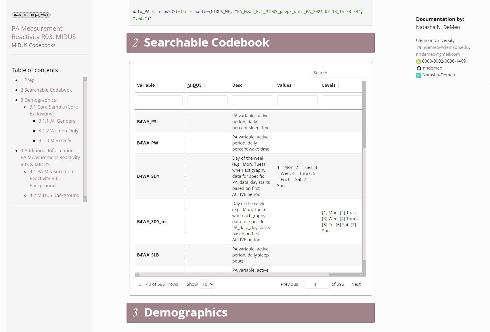

# Codebook/Data Dictionary Toolbox

Codebooks (or 'data dictionaries') are records that provide detailed information about variables in a dataset, including their names, descriptions, types, and coding schemes. They serve as a roadmap for understanding and using data correctly, ensuring clarity and consistency across research projects. By offering a comprehensive reference, codebooks make it easier to analyze datasets, reproduce studies, and collaborate effectively.

In many cases, codebooks are manually created and updated by the research team, often taking the form of a text document or spreadsheet. This manual process can be time-consuming and prone to errors, with the risk of inconsistencies between the codebook and the actual dataset properties. Additionally, manual methods often lack detailed records of modifications, making it difficult to track changes over time.

In my work as a data analyst, I have generated several tools that I routinely use to fill this need. I plan to release these materials as part of an R package for easy use by others, but currently feel they need additional testing to ensure their robust use. 

For now, I highlight these tools and their functionality as part of a broader data analytics portfolio. 

## Starting at the End: The Final Product

There are two major options for the final codebook produced via these tools: 

### The Codebook as a Spreadsheet

The first option is to create a codebook in the form of a spreadsheet with rows and columns. This can be exported into various file types for future use, such as .xlsx (Excel files), .RData (R files), .sas7bdat (SAS files), or .csv (Comma-Separated Values). I typically opt to export as a .csv file, which can be easily opened in programs like Excel and Google Sheets. It is also easy to export multiple formats.

The spreadsheet includes a row for each variable in the dataset it describes, and several columns that include details for each variable. These columns typically include: the variable's name, its original name (if this dataset/variable was modified from a pre-existing version, for example), a description ('variable label'), and a 'type' column to indicate the variable's type/class in R. There are several additional columns that I often include, which may or may not be filled in depending on the type of variable in each row. 

- Value Labels: Indicates whether the original values of the variable have been assigned names/categories to help understand what they represent, e.g., 0 = "Female", 1 = "Male",... and so on 
- Levels: Identifies the defined levels of a factor variable 
- Comments: An additional field for notes

### The Codebook as a Formatted HTML Document

The second option is to create a formatted HTML document, which can offer additional information and interactive features. This type of document, produced via R Markdown, can be viewed like a webpage in any internet browser (e.g., Chrome, Firefox). The HTML format allows for features like searchable and filterable tables, making it easier to navigate large datasets.

This output option requires setting up an R Markdown file (.Rmd), and I have a template that I reuse across projects, producing a formatted HTML file. Essentially, this allows me to embed the spreadsheet version of my codebook in a web-page style document as shown in the example below. I embed the codebook via a customized table built (primarily) from the 'reactable' package that is called via a custom R function that allows some easy modifications to the table functionality. One of the most helpful features is the ability to make the entire table and each column searchable/filterable, which can help identify variables of interest when you may not know the abstract variable name. 

These functions and the template are optimized for conversion to an HTML document, but it is possible to embed the spreadsheet into other document types, such as by using LaTeX to directly create PDFs.   

## Building and Modifying the Codebook: Highlighted Features

For right now, I do not delve into the details of all of the functions relevant to building and working with the codebook, but, instead, highlight a few key features: 

### 1) Not Starting From Scratch? Extracting Existing Attributes

Often, when working with existing datasets—whether from a colleague, repository, or as a template for a new project—these datasets already have labeled attributes we'd like to use or document in a codebook. I've created custom R functions to easily extract these attributes from any dataset imported into R, including those from SPSS and SAS. This process generates a spreadsheet version of the codebook, complete with variable labels, value labels, factor levels, and more.

### 2) Applying Attributes From The Codebook Back to the Data

Once in the spreadsheet version, attributes can be applied to existing data. Using more custom R functions, the variables in the codebook are matched to named variables in the dataset and attributes are selectively applied to those variables without additional manual coding. 

### 3) Incremental Changes DURING Data Processing and Analysis

One line of R code (powered by a custom function) allows a ['cleaning as you go'](https://www.google.com/search?q=cleaning%20as%20you%20go) style of documentation for building the codebook. These functions allow an analyst to easily add new or modified variables to the codebook as they are created (one at a time or in batches), so that variables are not left out or forgotten. This also helps to prevent the common scenario of saving the development of codebook documentation until the end of a project, when many details may be forgotten or not added at all.

As you process and analyze data, it's important to document changes to maintain an accurate and up-to-date codebook. With my tools, you can easily add new or modified variables to the codebook as you work, ensuring that all variables are documented in real-time. This ['cleaning as you go'](https://www.google.com/search?q=cleaning%20as%20you%20go) approach prevents the common issue of leaving codebook documentation until the end of a project when details might be forgotten (or, worse, the codebook might never be made).

